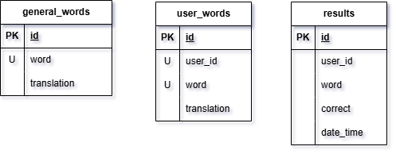

# English_Learning_Bot

Telegram-бот для изучения английских слов.  
Позволяет добавлять свои слова, удалять их и тренироваться в режиме практики.

---

## Функции

- Добавление своих слов (русское → английское)
- Удаление слов из личного словаря
- Режим практики с выбором правильного перевода
- Использование общих слов из базы + пользовательских
- Хранение данных в PostgreSQL

---

## Технологии

- Python 3
- [pyTelegramBotAPI](https://github.com/eternnoir/pyTelegramBotAPI)
- PostgreSQL
- `python-dotenv` — для переменных окружения

---

## Установка

1. Клонируйте репозиторий:
   `bash git clone https://github.com/Rom2555/English_learning_bot.git cd English_learning_bot`
2. Установите зависимости:
   `bash pip install -r requirements.txt`
3. Создайте файл `.env` в корне проекта:
   `env TOKEN=ваш_токен_от_BotFather DB_HOST=localhost DB_NAME=имя_вашей_базы_данных DB_USER=имя_пользователя_БД DB_PASS=пароль_БД DB_PORT=5432`
4. Убедитесь, что у вас запущен PostgreSQL, и создайте базу данных:
   `sql CREATE DATABASE имя_вашей_базы_данных;`
5. Положите файл `general_words.json` в корень.
6. Запустите бота:
   `bash python main.py`

---

## Структура проекта

- main.py # Точка входа, запуск бота
- handlers.py # Обработчики команд и сообщений
- database.py # Работа с PostgreSQL
- words.py # Управление словами
- practice.py # Логика практики
- keyboards.py # Клавиатуры Telegram
- general_words.json # База общих слов
- .env # Переменные окружения
- requirements.txt # Зависимости
- general_words.json # Файл с общими для всех пользователей словами

## Формат `general_words.json`

    json [ { "word": "кошка", "translation": "cat" }, { "word": "собака", "translation": "dog" }, { "word": "дом", "translation": "house" } ]

---

## Пример использования

1. Напишите боту `/start`
2. Выберите одну из кнопок:
    - **Добавить слово** → введите слово на русском, затем его перевод
    - **Удалить слово** → введите слово на русском, чтобы удалить
    - **Практика** → выберите правильный перевод из предложенных

---

## Хранение данных

Бот использует PostgreSQL для хранения:

- `general_words` — общие слова (из `general_words.json`)
- `user_words` — слова, добавленные пользователями
- `results` — результаты тренировок (для статистики)

Схема базы данных:

---

## Автор

@Rom2555

Учебный проект для курса Нетологии

---

## Благодарности

Спасибо [BotFather](https://t.me/BotFather) за токен, и вам - за использование!